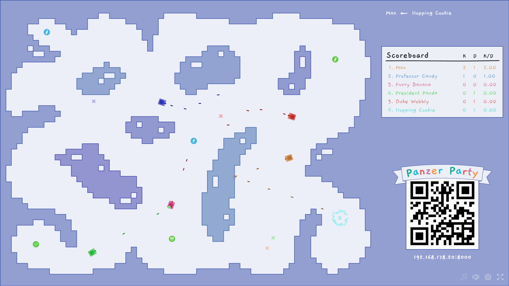
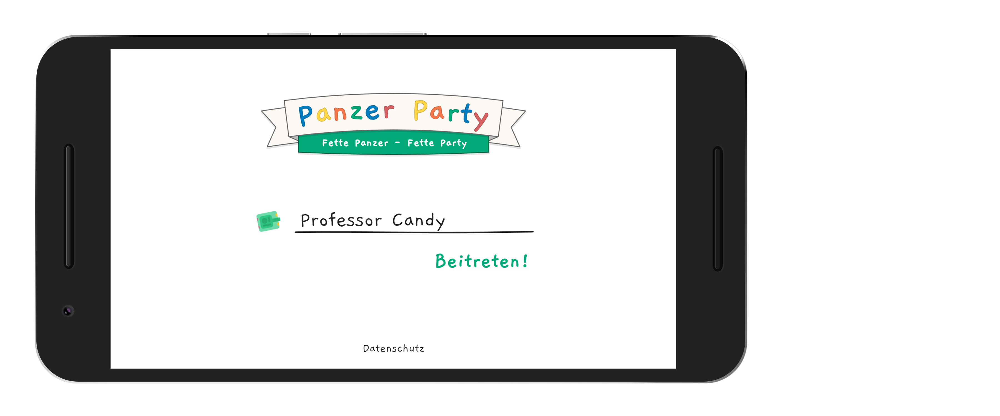
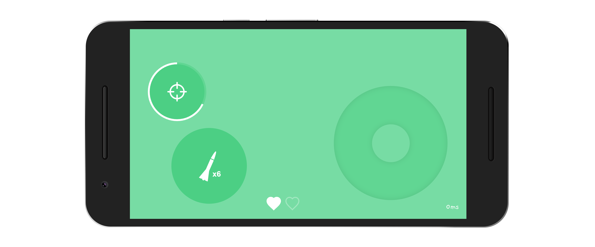



&nbsp;  
&nbsp;  

&nbsp;  

## Spielregeln und grundlegende Funktionalität & GoodToKnows:
##### Kugelverhalten (ohne Powerups)
* (durch Spieler abgefeuerte) Kugeln prallen 3-Mal von Wänden ab
* 6 Kugeln pro Spieler können sich maximal gleichzeitig auf dem Spielfeld befinden
* Selbst abgefeuerte Kugeln treffen auch den eigenen Panzer
* Kugeln fügen Panzern (und Bots) 50 Schaden zu
##### Panzer
* Panzer besitzen 100 Lebenspunkte (**2x Herzen * 50 Lebenspunkte**) und müssen demnach 2 mal getroffen werden um zerstört zu werden
##### Bots
    * 1 Bot spawned jede volle Minute (1:00, 2:00, 3:00)
    * Bots besitzen 500 Lebenspunkte
    * von Bots abgefeuerte Kugeln prallen nicht von Wänden ab
    * Bots despawnen wenn:
##### Spielziel & Ende
* Das Zerstören eines anderen Panzers fügt dem Spieler der die Kugel abgefeuerte hat einen "Kill" (K im Scoreboard) hinzu
* Das Zerstören eines Bots erzielt 5 Kills
* Der Spieler der zuerst 20 Kills erzielt hat, gewinnt das Spiel

## Steuerung

##### Bewegung des Panzers:
* Die Richtung und "Intensität" des Joysticks bestimmt die Richtung und die Geschwindigkeit der Bewegung
##### Schüsse Abfeuern:
* Durch drücken des Schuss-Buttons wird ein Schuss in die Richtung der momentanen Ausrichtung des Panzers abgefeuert
* Pro Spieler können sich nur 6 Kugeln gleichzeitig auf dem Spielfeld befinden und ein Feuern weiterer Kugeln ist in diesem Fall nicht möglich bis eine Kugel vom Spielfeld verschwindet
##### Aktivieren von "Powerups"
* Durch einmaliges drücken des Powerup-Buttons wird das zuvor eingesammelte Powerup aktiviert
* Je nach Typ des Powerups variiert der weitere Einsatz:
    * Waffen-Modifikator: 
        * Der Button löst nun **einen** Schuss des modifizierten Waffentyps aus. (zählt nicht zu den 6 normal abfeuerbaren Kugeln)
        * Die Umrandung des Buttons zeigt die verbleibenden Schüsse mit dem Waffentyp an
    * gegnerische Beeinträchtigung
        * ein farbiger Effekt legt sich über die Karte und beeinträchtigt die Attribute der anderen Panzer
    * Attributsverbesserung
        *  modifiziert sofort die eigenen Attribute (Bewegungsgeschwindigkeit, Kugelgeschwindigkeit, etc)
        *  die Umrandung des Buttons zeigt die verbleibende Dauer des Effekts an
##### Wiederbeleben nach Eliminierung
    * Nach der eigenen Eliminierung, zählt ein Countdown von 4 Sekunden herunter
    * Nach Ablauf des Countdowns kann auf "Respawn" gedrückt werden um dem Spielfeld erneut beizutreten

## Anleitung
#### Client
1. Nodejs installieren
2. **install_package.bat** zum installieren der Node-Modules ausführen
3. Den hostenden Rechner mit dem Wlan Hotspot verbinden
	**Name:  *PanzerParty***
	**Passwort:  *abc123***
4. **run.bat** ausführen um den Node.js Server zu starten
5. **http://localhost:8000** im Browser aufrufen
6. Zum erstellen einer Lobby auf Party klicken
7. Die gewählte Karte nutzen oder durch das klicken auf die angezeigte Karte eine andere Karte auswählen

--AUF VERBINDUNG DER MOBILGERÄTE WARTEN--

(8.) Verbundene Spieler/Geräte werden rechts neben der Karte angezeigt
(8.) Ist kein Spieler zu sehen ist die Lobby noch leer

11. Auf Start klicken
12. ### PARTY! 

#### Mobile Controller (Handy)

--AUF CLIENT START WARTEN--

6. Mobilgerät mit dem Wlan Hotspot verbinden
	**Name:  *PanzerParty***
	**Passwort:  *abc123***
7. Bei Möglichkeit den QR-Code mit dem Handy einscannen (oder die angezeigte IP-Adresse manuell eintippen)
8. Name in das Eingabefeld eingeben
9. Wunschfarbe durch antippen des Panzers auswählen
10. Beitreten antippen und so der Lobby beitreten

--AUF SPIELSTART WARTEN--

12. ### PARTY!
