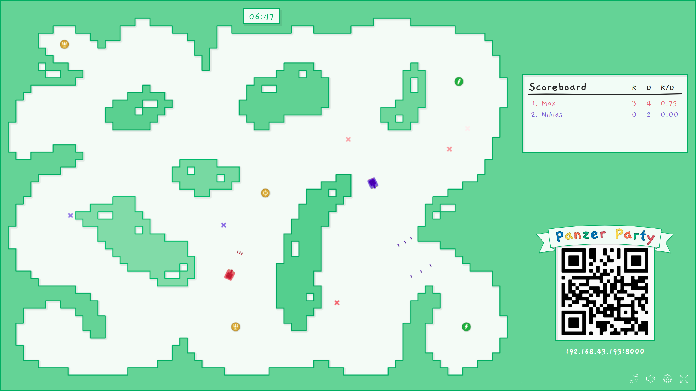

&nbsp;
##### Panzer Party ist ein local Network multiplayer PvP-Spiel mit Steuerung über das Smartphone. Die Spieler
##### steuern ihren Panzer auf kleinen Maps und versuchen sich gegenseitig mit abprallenden Kugeln zu treffen. 
##### Die vielen verschiedenen Powerups, Maps und Bots machen das Spielen abwechslungsreich und spannend.
##### Ein Muss für jede Party!
&nbsp;  

&nbsp;  

## Spielregeln und grundlegende Funktionalität & GoodToKnows:
##### Kugelverhalten (ohne Powerups)
    * (durch Spieler abgefeuerte) Kugeln prallen 3-Mal von Wänden ab
    * 6 Kugeln pro Spieler können sich maximal gleichzeitig auf dem Spielfeld befinden
    * Selbst abgefeuerte Kugeln treffen auch den eigenen Panzer
    * Kugeln fügen Panzern (und Bots) 50 Schaden zu
##### Panzer
    * Panzer besitzen 100 Lebenspunkte (**2x Herzen * 50 Lebenspunkte**)
    und müssen demnach 2 mal getroffen werden um zerstört zu werden
##### Bots
    * Der erste Bot spawned bei Minute 1
    * Ist ein Bot besiegt, spawnt eine Minute später ein neuer
    * Bots besitzen 500 Lebenspunkte
    * von Bots abgefeuerte Kugeln prallen nicht von Wänden ab
##### Spielziel & Ende
    * Das Zerstören eines anderen Panzers fügt dem Spieler der die Kugel abgefeuerte
    hat einen "Kill" (K im Scoreboard) hinzu
    * Das Zerstören eines Bots erzielt 3 Kills
    * Der Spieler der zuerst 20 Kills erzielt hat, gewinnt das Spiel

## Steuerung

##### Bewegung des Panzers:
* Die Richtung und "Intensität" des Joysticks bestimmt die Richtung und die Geschwindigkeit der Bewegung
##### Schüsse Abfeuern:
* Durch drücken des Schuss-Buttons wird ein Schuss in die Richtung der momentanen Ausrichtung des Panzers abgefeuert
* Jeder Spieler kann nur 6 von sich abgefeuerte Kugeln auf dem Spielfeld besitzen und ein Feuern weiterer Kugeln ist in diesem Fall (für diesen Spieler) nicht möglich bis eine Kugel vom Spielfeld verschwindet
##### Aktivieren von "Powerups"
* Es kann zu jeder Zeit nur ein Powerup den Powerup-Slot belegen
    * ist der Powerupslot befüllt können keine weiteren Powerups eingesammelt werden 
* Durch einmaliges drücken des Powerup-Buttons wird das zuvor eingesammelte Powerup aktiviert
* Je nach Typ des Powerups variiert der weitere Einsatz:
    * Waffen-Modifikator: 
        * Der Button löst nun **einen** Schuss des modifizierten Waffentyps aus. (zählt nicht zu den 6 normal abfeuerbaren Kugeln)
        * Die Umrandung des Buttons zeigt die verbleibenden Schüsse mit dem Waffentyp an
    * gegnerische Beeinträchtigung
        * ein farbiger Effekt legt sich über die Karte und beeinträchtigt die Attribute der anderen Panzer
    * Attributsverbesserung
        *  modifiziert sofort die eigenen Attribute (Bewegungsgeschwindigkeit, Kugelgeschwindigkeit, etc)
##### Wiederbeleben nach Eliminierung
* Nach der eigenen Eliminierung, zählt ein Countdown von 3 Sekunden herunter
* Nach Ablauf des Countdowns kann auf "Respawn" gedrückt werden um dem Spielfeld erneut beizutreten

## Powerups

## Requirements
+ **Node.JS**
+ sowohl Spieler als auch Host müssen sich im selbem Netzwerk befinden
    + Netzwerk muss PeerToPeer-Verbindungen (Client to Client) unterstützen   
+ **16:9 Format** 
+ **Smartphone** (mit aktuellem unterstütztem Browser)
## Installation
1. `Node.JS` installieren
2. `install_package.bat` zum installieren der Node-Modules ausführen

## Anleitung - Spiel Start  (Desktop)
1. `run.bat` ausführen um den `Node.JS` Server zu starten
2. **http://localhost:8000** im Browser aufrufen
3. Zum erstellen einer Lobby auf ***Spiel starten*** klicken
4. Die gewählte Karte nutzen oder durch das klicken auf die angezeigte Karte das Auswahlmenü aufrufen und eine andere Karte auswählen
5. Nach Beitritt der Spieler,  ***Start*** drücken um das Spiel zu starten

## Anleitung - Lobby Beitritt   (Smartphone)
1. Nach Beitritt in das gemeinsame Netzwerk  entweder:
    * durch das Scannen des QR-Codes
    * oder die IP-Adresse unterhalb des QR-Codes manuell in die Adresszeile eingetippen um
   dem Server bei zutreten
2. Namen eingeben und Farbe (durch antippen des Panzers) auswählen (bereits durch andere Spieler ausgewählte Farben sind nicht verfügbar)
3. ***Beitreten*** antippen um der Lobby beizutreten

## Supported auf folgenden Platformen

## Known Bugs
* Nach Überschreibung einer bereits existierenden Map muss der Server neu gestartete werden um die an der an der Map vorgenommenen Änderungen zu übernehmen

## Used Content
#### Icons
https://www.flaticon.com/free-icon/tombstone_91445 designed by **Freepik** from Flaticon.
https://www.flaticon.com/free-icon/skull-and-bones_91416 designed by **Freepik** from Flaticon.
https://www.flaticon.com/free-icon/smartphone-call_15874 designed by **Freepik** from Flaticon.
https://www.flaticon.com/free-icon/missile-weapon-silhouette-side-view_30995 designed by **Freepik** from Flaticon.
https://www.flaticon.com/free-icon/speaker_149140 designed by **Smashicons** from Flaticon.
https://www.flaticon.com/free-icon/music-player_149103 designed by **Smashicons** from Flaticon.
https://www.flaticon.com/free-icon/settings_149294 designed by **Smashicons** from Flaticon.
https://www.flaticon.com/free-icon/expand_134195 designed by **Smashicons** from Flaticon.
https://www.flaticon.com/free-icon/target_118753 designed by **Lucy G** from Flaticon.
https://www.flaticon.com/free-icon/bounce_637822 designed by **Those Icons** from Flaticon.
https://www.flaticon.com/free-icon/flash_252851 designed by **Smashicons** from Flaticon.
https://www.flaticon.com/free-icon/bullet_225817 designed by **Smashicons** from Flaticon.
https://www.flaticon.com/free-icon/snail_577522 designed by **Freepik** from Flaticon.
https://www.flaticon.com/free-icon/spanner-wrench_2056 designed by **Freepik** from Flaticon.

#### Music
"Cattails" Kevin MacLeod (incompetech.com) Licensed under Creative Commons: By Attribution 3.0 License
"Wheelwagon" Kevin MacLeod (incompetech.com) Licensed under Creative Commons: By Attribution 3.0 License

https://freesound.org/people/ThompsonMan/sounds/107341/ Licensed under Creative Commons: By Attribution 3.0 License
https://freesound.org/people/InspectorJ/sounds/345558/ Licensed under Creative Commons: By Attribution 3.0 License
https://freesound.org/people/audiosmedia/sounds/170583/ Licensed under Creative Commons: By Attribution 3.0 License
https://freesound.org/people/CrazyFrog249/sounds/161628/ Licensed under Creative Commons: By Attribution 3.0 License
https://freesound.org/people/schademans/sounds/13283/ Licensed under Creative Commons: By Attribution 3.0 License
